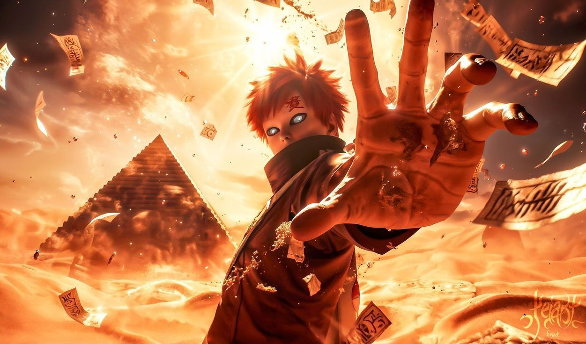

# 🔴 Gaara of the Desert - Tribute Page

> "The only reason we are so attached to memories is that they don't change, even if the people have changed." - Gaara

## 💫 A Tribute to the Sand's Guardian

This project is a loving tribute to one of the most compelling characters in the Naruto universe - Gaara of the Desert. From a feared jinchūriki to the respected Fifth Kazekage, Gaara's journey represents one of the most powerful redemption arcs in anime history.

As a fellow Gaara enthusiast, I've poured my heart into creating an immersive experience that captures the essence of his character - the isolation, the power, and ultimately, the transformation. The dark theme with red accents reflects both his past darkness and the blood that once defined him, while the sand elements pay homage to his unique abilities.

## ✨ Features

- **Immersive Visual Experience**: Dark theme with red accents and sand-colored elements that reflect Gaara's character
- **Parallax Scrolling Effects**: Dynamic scrolling that brings the page to life
- **Custom Sand Particle Animation**: Subtle floating sand particles across the entire page
- **Custom Cursor**: Unique cursor design that enhances the user experience
- **Responsive Design**: Fully responsive layout that works on all devices
- **Character Information**: Detailed sections about Gaara and Shukaku
- **Background Music**: Optional Gaara-themed background music
- **Custom Typography**: Special font treatments including sand and blood text effects
- **Animated Elements**: Subtle animations throughout the page for a dynamic experience
- **Interactive Components**: Elements that respond to user interaction

## 🛠️ Technologies Used

- **Next.js**: React framework for building the application
- **TypeScript**: For type-safe code
- **Tailwind CSS**: For styling and responsive design
- **Framer Motion**: For smooth animations and transitions
- **Lucide React**: For icons
- **Next Font**: For custom typography

## 🚀 Getting Started

### Prerequisites

- Node.js (v18 or higher)
- npm or yarn

### Installation

1. Clone the repository:
   \`\`\`bash
   git clone https://github.com/yourusername/gaara-tribute.git
   cd gaara-tribute
   \`\`\`

2. Install dependencies:
   \`\`\`bash
   npm install
   # or
   yarn install
   \`\`\`

3. Run the development server:
   \`\`\`bash
   npm run dev
   # or
   yarn dev
   \`\`\`

4. Open [http://localhost:3000](http://localhost:3000) in your browser to see the result.

## 🎨 Customization

Feel free to customize this tribute page to reflect your own appreciation for Gaara:

- Replace placeholder images with your favorite Gaara and Shukaku images
- Add your preferred Gaara theme music
- Expand the content with more quotes or information about his journey
- Add additional sections like a timeline of his character development or a gallery of his different forms

## 💭 About Gaara

Gaara's journey from a feared "monster" to a respected leader represents one of the most profound character developments in the Naruto series. Born as a jinchūriki of Shukaku, Gaara's early life was marked by isolation and hatred, leading him down a path of violence.

What makes Gaara so compelling is how his encounter with Naruto Uzumaki - another jinchūriki who faced similar challenges but chose a different path - completely transformed his worldview. This transformation from someone who lived only to kill others to someone who would sacrifice himself to protect his village is what makes him such a beloved character.

His iconic gourd, the "Love" (愛) kanji scarred on his forehead, and his unique sand abilities make him instantly recognizable, while his quiet strength and wisdom make him unforgettable.

## 📝 Personal Note

As a fellow Gaara fan, I understand the deep connection many of us feel to this character. His struggle with loneliness, his journey to find purpose beyond violence, and his eventual growth into a protective leader resonates with many of us. This project is my way of honoring a character who taught us that our past doesn't have to define our future, and that even those who start in darkness can find their way to the light.

## 🙏 Acknowledgments

- Masashi Kishimoto for creating such a profound character
- The Naruto community for keeping the love for these characters alive
- All Gaara fans who understand why this character means so much to us

## 📄 License

This project is licensed under the MIT License - see the LICENSE file for details.

--------------

# 🔴 Gaara do Deserto - Página de Tributo

> "A única razão pela qual somos tão apegados às memórias é que elas não mudam, mesmo que as pessoas tenham mudado." - Gaara

## 💫 Uma Homenagem ao Guardião da Areia

Este projeto é uma homenagem carinhosa a um dos personagens mais cativantes do universo Naruto - Gaara do Deserto. De um temido jinchūriki ao respeitado Quinto Kazekage, a jornada de Gaara representa um dos arcos de redenção mais poderosos da história dos animes.

Como um fã de Gaara, me dediquei a criar uma experiência imersiva que capturasse a essência de seu personagem - o isolamento, o poder e, por fim, a transformação. O tema sombrio com detalhes em vermelho reflete tanto sua escuridão passada quanto o sangue que o definiu, enquanto os elementos de areia prestam homenagem às suas habilidades únicas.

## ✨ Recursos

- **Experiência Visual Imersiva**: Tema escuro com detalhes em vermelho e elementos em tons de areia que refletem o caráter de Gaara
- **Efeitos de Rolagem Parallax**: Rolagem dinâmica que dá vida à página
- **Animação Personalizada de Partículas de Areia**: Sutis partículas de areia flutuantes por toda a página
- **Cursor Personalizado**: Design exclusivo do cursor que aprimora a experiência do usuário
- **Design Responsivo**: Layout totalmente responsivo que funciona em todos os dispositivos
- **Informações do Personagem**: Seções detalhadas sobre Gaara e Shukaku
- **Música de Fundo**: Música de fundo opcional com tema de Gaara
- **Tipografia Personalizada**: Tratamentos especiais de fonte, incluindo efeitos de texto em tons de areia e sangue
- **Elementos Animados**: Animações sutis por toda a página para uma experiência dinâmica
- **Componentes Interativos**: Elementos que respondem à interação do usuário

## 🛠️ Tecnologias Utilizadas

- **Next.js**: Framework React para construção do aplicativo
- **TypeScript**: Para código com tipagem segura
- **Tailwind CSS**: Para estilização e design responsivo
- **Framer Motion**: Para animações e transições suaves
- **Lucide React**: Para ícones
- **Next Font**: Para tipografia personalizada

## 🚀 Começando

### Pré-requisitos

- Node.js (v18 ou superior)
- npm ou yarn

### Instalação

1. Clone o repositório:
\`\`\`bash
git clone https://github.com/seunomedeusuário/gaara-tribute.git
cd gaara-tribute
\`\`\`

2. Instale as dependências:
\`\`\`bash
npm install
# ou
yarn install
\`\`\`

3. Execute o servidor de desenvolvimento:
\`\`\`bash
npm run dev
# ou
yarn dev
\`\`\`

4. Abra [http://localhost:3000](http://localhost:3000) no seu navegador para ver o resultado.

## 🎨 Personalização

Sinta-se à vontade para personalizar esta página de homenagem para refletir sua própria apreciação por Gaara:

- Substitua as imagens de espaço reservado por suas imagens favoritas de Gaara e Shukaku
- Adicione sua música tema preferida de Gaara
- Expanda o conteúdo com mais citações ou informações sobre sua jornada
- Adicione seções adicionais, como uma linha do tempo do desenvolvimento de seu personagem ou uma galeria de suas diferentes formas

## 💭 Sobre Gaara

A jornada de Gaara, de um "monstro" temido a um líder respeitado, representa um dos desenvolvimentos de personagem mais profundos da série Naruto. Nascido como um jinchūriki de Shukaku, a infância de Gaara foi marcada por isolamento e ódio, levando-o por um caminho de violência.

O que torna Gaara tão cativante é como seu encontro com Naruto Uzumaki – outro jinchūriki que enfrentou desafios semelhantes, mas escolheu um caminho diferente – transformou completamente sua visão de mundo. Essa transformação de alguém que vivia apenas para matar os outros para alguém que se sacrificaria para proteger sua aldeia é o que o torna um personagem tão amado.

Sua icônica cabaça, o kanji "Amor" (愛) marcado em sua testa e suas habilidades únicas com areia o tornam instantaneamente reconhecível, enquanto sua força silenciosa e sabedoria o tornam inesquecível.

## 📝 Nota Pessoal

Como fã de Gaara, entendo a profunda conexão que muitos de nós sentimos com esse personagem. Sua luta contra a solidão, sua jornada para encontrar um propósito além da violência e seu eventual crescimento como um líder protetor ressoam em muitos de nós. Este projeto é minha maneira de homenagear um personagem que nos ensinou que nosso passado não precisa definir nosso futuro e que mesmo aqueles que começam na escuridão podem encontrar o caminho para a luz.

## 🙏 Agradecimentos

- Masashi Kishimoto por criar um personagem tão profundo
- A comunidade de Naruto por manter vivo o amor por esses personagens
- Todos os fãs de Gaara que entendem por que esse personagem significa tanto para nós

## 📄 Licença

Este projeto está licenciado sob a Licença MIT - consulte o arquivo de LICENÇA para obter detalhes.

